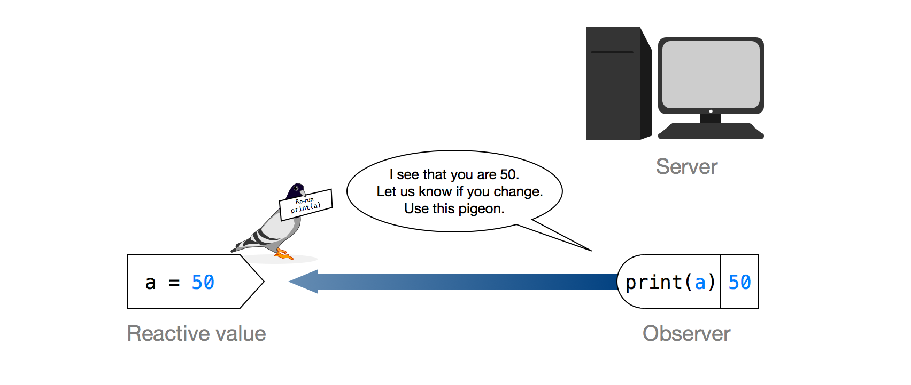
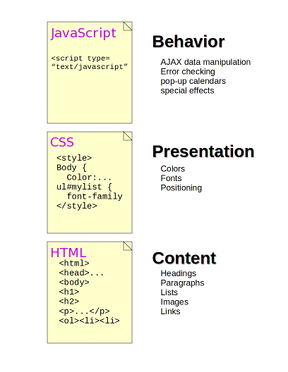
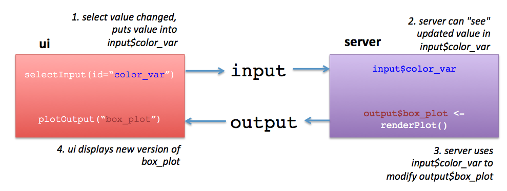

```{r setup, include=FALSE}
knitr::opts_chunk$set(echo = FALSE)
```

# A first encounter

## This workshop {.columns-2}

**Me:**

 - Statistician at Bio-engineering
 - R programmer
 - maintains statapps Shiny server
 - R instructor for 9 years now
 
**This course:**

 - No printed slides : info on the web
 - No mandatory exercises : let's do sth useful
 - all materials available on github
 - Your input makes this course 

## Topics to discuss

 - Day 1: Introduction to the Shiny framework and ecosystem
 - Day 2: Apps, interactive documents, dashboards
 - Day 3: reactivity: the server backend
 - Day 4: working with modules
 - Day 5: debugging and profiling
 
Other possibilities :

 - interactive plots/tables with `plotly` and `DT`
 - deployment from github
 - Uploading/downloading 
 - error handling with `req()` and `validate()`
 - async programming 
 - ...
 
## A short history of Shiny

 - originally developed by Winston Chang (2012)
 - intended for production, but initially used for teaching
 - RStudio now develops Shiny (WC joined in 2012) 
 - Version 1.0 came out in 2017, the first version ready for production
 - since then: more debugging, profiling, threading power, ...
 
 Shiny is a framework for **reactive programming**
 

## Only Shiny?

 - `shinythemes`: ready themes for a different layout
 - `shinydashboard` : modern dashboard (looks better than default)
 - `flexdashboard` : simple dashboard with RMarkdown
 - `shinyjs`: extension of functionality with JavaScript-like operations
 - `htmlwidgets` : wrap existing widgets in RMarkdown, Shiny, ...
 - `shinyjqui` : interaction/animation effects like dragging, resizing, ...
 - `shinycssloaders`: add a loader animation/spinner
 - ...
 

## The problem to solve

Take a simple script

```{r, eval = FALSE, echo = TRUE}
n <- 20
samp <- rnorm(n)
hist(samp)
```

Every time you change `n`, you need to rerun the script.

How to automatically update the plot every time the input changes?

 $\rightarrow$ Interactive app

## A simple shiny app 

```{r}
numericInput("n", label = "Pick a sample size",
             value = 20, min = 5, max = 50, step = 5 )
```

```{r}
renderPlot({
  samp <- rnorm(input$n)
  hist(samp, col = "blue",
       main = paste("Sample size:",
                    input$n))
}, width=1000, height = 380)
```

## Code of this simple shiny app {.columns-2}

`numericInput` for setting `n`.

```{r, eval = FALSE, echo = TRUE}
numericInput("n", label = "Sample size",
             value = 20, min = 5, 
             max = 50, step = 5 )
```

 - `"n"` is the name of the input
 - to catch the value, `input$n` is used
 - `value` is the initial value
 - allows to set boundaries, but these can be overridden!
 

`renderPlot` displays the histogram

```{r, eval = FALSE, echo = TRUE }
renderPlot({
  samp <- rnorm(input$n)
  hist(samp, col = "blue",
       main = paste("Sample size:",
                    input$n))
}, width=1000, height = 380)
```

 - expression between `{}` 
 - `width` and `height` count for the rendered plot!
 
## How does this work?

 - output flags to input "I have your value, let me know when changed."
 - when changed, input sends message "here's my new value, rerun plz"
 
$\rightarrow$ a **reactive value** signals when it's changed.

$\rightarrow$ a **observer** waits for a signal of change to run code
 
 ```{r, out.width='70%', fig.align='center'}

```

## Creating an interactive website

 - frontend: The interface to the user = browser
 - backend: The server where data is stored / processed
 
```{r, out.width='70%', fig.align='center'}

```

 
## Creating an interactive website {.columns-2}

Frameworks for frontend:

 - **HTML** : the content/structure
 - **CSS** : the style/presentation
 - **JavaScript** : the action

Shiny :

 - allows frontend without knowledge of HTML/CSS/JS
 - uses R session as backend
 - knowledge of HTML/CSS/JS is useful for more advanced work
 
```{r, out.width='70%', fig.align='center', fig.cap='web tech'}

```

## Creating a stand-alone app

In Shiny we have :

 - a frontend called `UI` : gets inputs, shows outputs
 - a backend called `server` : renders outputs
 
A standard Shiny app can be :

 - a stand-alone file called `app.R` in its own folder.
 - two files `ui.R` and `server.R` in their own folder.
 

 
## The different parts of the app:

**UI** : a interface object, eg `fluidPage`

 - Has `___Input` functions for user input
 - Has `___Output` functions for showing rendered output
 - input and output are labelled by id tags (character values)
 
**server** : A function with `input` and `output` as first 2 arguments

 - Has `render___` functions to render output
 - gets input from `input` : list object
 - sends output through `output` : list object
 - names of input/output are the id tags from UI side

`shinyApp` creates the shiny app object to run.

## Keep in mind!

 - every `___Output` function is linked to a `render___` function.
 - UI side uses character tags, server side list objects
 
```{r, out.width='90%', fig.align='center'}

```
 
## Organisation of a layout :

 - **Page** : main unit. Can be `fluidPage()`, `navbarPage()`, ...
 - **Panel** : A subsection of a Page. This can be a sidebar but also a tab.
 - **widget** : a functional unit, either taking input or displaying output.
 
Input widgets : http://shiny.rstudio.com/gallery/widget-gallery.html

### Try it yourself

 1. Take a look at the demo App
 1. Click File $>$ New File $>$ Shiny Web App
 2. Create a single file app 
 
## A first encounter with reactive values

In the demo example, we create a dataset within the plot code.

**Problem**

 - too much operations slow down plot code
 - not all objects need recalculation every time
 
**Solution**: `reactive()` creates reactive value

 - value that updates on changed input
 - value that doesn't generate output for UI
 
## Example {.columns-2}

```{r}
 selectInput("b1","distribution X", choices = c("norm","exp"))
 selectInput("b2","distribution Y", choices = c("norm","exp"))
```

```{r}
 x <- reactive({
   f <- switch(input$b1, norm = rnorm, exp = rexp)
   f(50)
 })
 y <- reactive({
   f <- switch(input$b2, norm = rnorm, exp = rexp)
   f(50)
 })
 renderPlot({plot(x(), y())} )
```

## Code for reactive values

**UI**

```{r, eval = FALSE, echo = TRUE}
 selectInput("b1","distribution X", choices = c("norm","exp"))
 selectInput("b2","distribution Y", choices = c("norm","exp"))
```

**Server**

```{r, eval = FALSE, echo = TRUE}
 x <- reactive({
   f <- switch(input$b1, norm = rnorm, exp = rexp)
   f(50)
 })
 y <- reactive({
   f <- switch(input$b2, norm = rnorm, exp = rexp)
   f(50)
 })
 renderPlot({plot(x(), y())} )
```

## Using `reactive()`

 - Output is stored as reactive object (here `x` and `y`)
 - reactive values are updated when input is updated
 - reactive values are accessed as function! (`x()`)

Linkage :

 - `renderPlot()` depends on `x()` and `y()`
 - `x()` depends on `input$b1`
 - `y()` depends on `input$b2`
 
### Try it yourself

 - adapt the demo app so that the plot data is generated as reactive object

## Sources

 - Basics : http://shiny.rstudio.com/articles/basics.html
 - Stand alone app : http://shiny.rstudio.com/articles/build.html
 - Tutorials : http://shiny.rstudio.com/tutorial/
 - Basic reactivity: http://shiny.rstudio.com/articles/understanding-reactivity.html
 - Reference : http://shiny.rstudio.com/reference/shiny/1.3.2/
 - widget gallery : http://shiny.rstudio.com/gallery/widget-gallery.html

## Extra exercises : Linear regression

 - Create an application that lets you select two numeric variables from the data frame Iris, and that creates a plot with a linear regression using ggplot.
 - Add under the plot a verbatim text output with the summary of the linear model
 
## Extra exercises : Distribution of the mean

Create a shiny app that takes the following inputs :

 - number n of observations in a sample (5 to 50)
 - number p of samples (10 to 1000)
 - A selector for a distribution
 
It should:

 - generate p samples of n observations from a distribution as selected
 - calculate the mean for all p samples
 - show a histogram of those means
