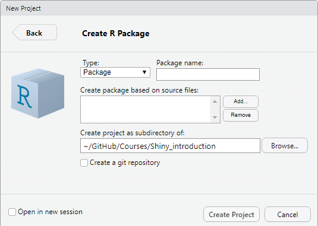
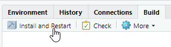

  
```{r setup, include=FALSE}
knitr::opts_chunk$set(echo = FALSE)
library(miniUI)
```

# Sharing your applications

## Different goals require different solutions.

**Passing scripts**:

 - Helps R users
 - Users can change the code: flexible but unstable
 
**Integrating in RStudio with package**:

 - Helps R users
 - code is protected from unwanted changes
 - can be rolled out 
 
**Hosting on a web service**:

 - Also non-R users can use the app
 - Needs server deployment and admin
 - code is inaccessible/hidden

## Web services to host

Two main possibilities:

|        | Shiny Server (open) | ShinyProxy    |
| :----- | :----------------- | :----------   |
| From   | RStudio            | OpenAnalytics |
| App | Directory on server | Docker containers |
| Setup        | less complex   | more complex      |
| Users per app | All in same session | one session per user | 
| scalability  | Buy Pro        | in theory infinitely scaleable |

## Provide a GUI for complex functions

Until now: shiny apps as an independent unit: no return value

**Gadgets** :

 - Have a simple interface
 - Return a value when done
 - Are defined in a regular function
 - Can be used in a package or as RStudio addin
 
To build a gadget: need package `miniUI`

## Example of a gadget

```{r, echo = TRUE}
pickAcolor <- function(){
  
  ui <- miniPage(
    gadgetTitleBar("Select a color"),
    miniContentPanel(
      selectInput("col", "Pick a color",
                  choices = c("red","green","blue"))
    ))
  
  server <- function(input, output, session){
    observeEvent(input$done, {
      returnValue <- input$col
      stopApp(returnValue)
    })
  }
  runGadget(ui,server)
}
```

## Example of a gadget

 - Define `ui` and `server` using `miniUI`
 - Gadget always contains a `Cancel` and `Done` button.
 - use `observeEvent()` for detecting click on `Done`.
 - use `stopApp(val)` to return the value `val`
 - Last line in function : `runGadget`
 
To keep in mind :

 - `miniContentPanel()` is the default container to use.
 - Gadgets fill the window: use `fillRow` and `fillCol`, not `fluidRow` and `column`!
 - tabsets are handled by `miniUI` :
     * `miniTabstripPanel` for the container
     * `miniTabPanel` for the tabs itself
     
## Decorating Mini tabbed layout

Main use is the same as `tabPanel` and containers. 

 - `miniTabPanel` allows for icons using `icon` argument.
 - icons come from [FontAwesome](https://fontawesome.com/icons?d=gallery&m=free) and [Glyphicons](https://www.glyphicons.com/sets/basic/) iconset
 - Use function `icon()` to define them
 
```{r, echo = TRUE, eval = FALSE}
icon(name = "human", lib="glyphicon")
```
 
## Filled layouts

Gadgets use a flex box: tries to fill the entire page.

 - when using `plotOutput()`, set relative height

```{r, echo = TRUE, eval = FALSE}
miniContentPanel(
  plotOutput("theplot", height = "50%"),
  plotOutput("AnotherPlot", height = "50%")
)
```

 - To fit buttons/inputs on a row: `miniButtonBlock()`
 
```{r, echo = TRUE, eval = FALSE}
miniButtonBlock(
  actionButton("reset", "Reset"),
  actionButton("build", "build Model")
)
```

## Filled layouts

To use a button block in between the tabstrip and the tabs:

 - create a `miniButtonBlock()` object
 - pass to argument `between` of `miniTabstripPanel()`
 
```{r, echo = TRUE, eval = FALSE}
theButton <- miniButtonBlock(actionButton("reset","Reset"))
...
minTabstripPanel(
  between = theButton,
  miniTabPanel("Data", icon = icon("table"),
    ...
    ),
  miniTabPanel( ... )
  )
```

## Share online with Github

 - Using Github gists:
     * Easy and "anonymous" sharing.
     * needs `ui.R` and `server.R` files in gist
     * run with `shiny::runGist('xxxxxxx')` where `xxxxxxx` is the gist ID number (you see that in the link)
     
```{r, echo = TRUE, eval=FALSE}
runGist("b283edcad3dd3ae9ffecd076eb87bbe7")
```

The gist: https://gist.github.com/JoFAM/b283edcad3dd3ae9ffecd076eb87bbe7

## Creating a gist

Gists are created on github by specifying the filename and copy-pasting

 - go to https://gist.github.com
 - if you don't have a github account, sign up
 - Log in and click on the + symbol top right next to your profile pic
 - add filename (eg app.R) and copy-paste the code 
 - for a 2-file app: use ui.R as filename. Click on "Add file" to add the
 server.R in the same gist!
 - click "Create public gist"
 - Profit

## Share online with Github

 - Using Github repos:
     * Full github repo version control
     * Apps can be run from a subdirectory
     * run with `shiny::runGitHub()`

```{r, echo = TRUE, eval = FALSE}
runGitHub("Shiny_introduction",
          "JoFAM",
          subdir = "Class1_BasicApps/Apps/BasicPlot/")
```

Github itself is a often used version control system for software projects.I love
it. If you want to try it out, find more info:

https://help.github.com/en

## Share in a package

How to write a package : see eg R Packages by H.Wickham

For a shiny app:

 - place app in `inst/appdir`.
 - create (and export) a function that contains:
```{r, echo=TRUE,eval=FALSE}
shiny::runApp(system.file('appdir'),
              package = 'namePackage')
```
 - Make sure you declare dependency on Shiny!
 - App is started by calling the function.

## Add Gadgets/Shiny apps to RStudio

This has to be done using a package.

 - add Gadget function (or app function) to the package.
 - Register the app function in a `.dcf` file. (see example)
 - store `.dcf` file as `inst/rstudio/addins.dcf`
 
```
Name: The app
Description: This app does stuff
Binding: appFun
Interactive: true
```

## Workflow to create a simple package

RStudio allows you to create a package relatively easy, if you're prepared to
skip over most of the details. More info in [R Packages](http://r-pkgs.had.co.nz/)
by Hadley Wickham.

 - go to File $>$ New Project $>$ New Directory $>$ R package
 
```{r, out.width='50%', fig.align='center'}

```

## Workflow to create a simple package

In this dialog : 

 - fill in the package name (one word)
 - Choose the directory where the package structure is placed
 - click on "Create Project"
 
RStudio will create a package skeleton with :

 - a file `DESCRIPTION`
 - a file `NAMESPACE` which you can leave untouched.
 - a folder `R` with a file `hello.R`. This file can be removed. The `R` folder
 is where your R scripts with function definitions go
 - a folder `man` with a file `hello.Rd`. Can be removed as well. This folder 
 contains the help pages (see also [`roxygen2`](http://r-pkgs.had.co.nz/man.html))

## Workflow to create a simple package

### Adapt the file DESCRIPTION:

Open it up and change the following fields:

 - `Package: pkgname` : `pkgname` is the name of the package
 - `Author: firstname lastname <my.email@serv.org>` : your details
 - `Maintainer` : same as Author
 - `Description: ...` : add a small description
 - `License: GPL>2` : use a standard license (check if you need other licenses)
 
Add a field:

 - `Imports: shiny, ggplot2` : list all packages used by the code in the package
 
## Workflow to create a simple package

### Add the shiny app

 - create a folder `inst` in the package folder.
 - In there, create a folder `appname` that contains the `app.R` or the `ui.R` and `server.R`
 of the shiny app.
 - in the `R` folder, create a R script (eg `runapp.R`) with the following structure:
 
```{r, echo = TRUE, eval = FALSE}
runapp <- function(){
  shiny::runApp(
    system.file("appname",
                package = "pkgname")
  )
}
```

`system.file` returns the location of the folder `appname` in the installed package.

## Workflow to create a simple package

To test your package, you click on the tab `Build` and click on `Install and Restart`

```{r, out.width='50%', fig.align='center'}

```

This makes a temporary build of the package and loads it. Now you can test your
function `runapp()`.

**The first time this might install Rtools if you didn't have it yet**

## Workflow to create a simple package

### Add the app as an addin in RStudio

 - create a folder `rstudio` in the folder `inst`.
 - click on File $>$ New File $>$ Text File
 - Add the dcf directives (see below)
 - save as `addins.dcf` in the folder `inst/rstudio` in the package.
 
```
Name: The app
Description: This app does stuff
Binding: runapp
Interactive: true
```

You can Install and Restart to check whether the app is added to the Addins.

## Workflow to create a simple package 

### Build the package

 - click in the Build tab on "More"
 - `Build Binary Package` Builds a Windows package
 - `Build Source Package` Builds a Linux/Mac package
 
They can be installed as:

```{r, eval = FALSE, echo =TRUE}
install.packages(
  "path/to/pkgname_0.1.0.zip",
  repos = NULL,
  type = "binary"
)
```

**Note:** for Linux you need a `.tar.gz` file and set `type="source"`


## Extra sources

 - Shiny gadgets : http://shiny.rstudio.com/articles/gadgets.html
 - Gadget UI :http://shiny.rstudio.com/articles/gadget-ui.html
 - RStudio addins : http://rstudio.github.io/rstudioaddins/
 - Packages : http://r-pkgs.had.co.nz/
 - Local deployment : http://shiny.rstudio.com/articles/deployment-local.html

### Online deployment

 - ShinyProxy : https://www.shinyproxy.io/
 - ShinyServer setup reference : https://docs.rstudio.com/shiny-server/
